<!-- 개발환경, 빌드 및 실행방법 작성 -->
<!-- 이거만 봐도 프로젝트를 이해할 수 있도록 -->

# SOLoTrip

골치 아픈 정산은 그만  
혼자 하는 여행처럼 간편하게!

소비 패턴 분석으로 여행 성향까지 알려주는 여행SOL루션 **SOLoTrip**

## Team 5일장

| 이름   | 구분 | 역할 및 수행업무                       |
| ------ | ---- | -------------------------------------- |
| OOO | 팀장 | 프론트엔드, Axios, UI/UX               |
| OOO | 팀원 | 프론트엔드, Axios, UI/UX, CSS          |
| OOO | 팀원 | 프론트엔드, 결제 카테고리화, AI 이미지 |
| OOO | 팀원 | DB, API, 인프라                        |

## 개발 환경

- **언어:** Python 3.11.4, JavaScript
- **프레임워크:** Django 5.1, Vue3
- **IDE:** Visual Studio Code
- **데이터베이스:** MySQL 8.0.39-0ubuntu0.24.04.1
- **버전 관리:** Git
- **빌드 및 배포 도구:** Docker, Jenkins

## 빌드 및 실행 방법

**SOLoTrip 홈페이지**: [SOLoTrip 홈페이지](https://5illjjang.click/)  
**SOLoTrip API Page**: [SOLoTrip API Page](https://5illjjang.click/api/)

현재 저희는 배포가 되어있는 상태로, SOLoTrip 페이지에서 개발한 기능은 모두 확인해보실 수 있습니다.  
하지만 혹시나 localhost에서 확인해보고 싶으실 수 있으니, 아래에 방법을 적어놓겠습니다.

### local host 빌드 방법

#### 주의사항

현재 Django는 MySQL과 연결된 상태이고, MySQL은 EC2에서 구동되고 있습니다.  
즉, `.env`파일의 변수들이 없다면, localhost에서 기능 테스트는 불가합니다.  
물론 배포된 사이트에선 가능합니다.  
만약 테스트를 해보고 싶으시다면, 5일장 팀원 `정태완`에게 연락주시면 해당 변수 값이 담긴 `.env`파일을 개별적으로 보내드리겠습니다.

##### 연락처

```json
{ "전화번호": "010-6369-7071", "email": "oodeng98@naver.com" }
```

#### Django 실행 방법

1. `backend` branch로 이동: `git switch backend`
2. SOLoTrip 폴더로 이동: `cd SOLoTrip`
3. 가상환경 생성: `python -m venv venv`
4. 가상환경 활성화: `source venv/Scripts/activate`
5. 라이브러리 설치: `pip install -r requirements`
6. Django 서버 실행: `python manage.py runserver`

#### Vue3 localhost 빌드 방법

1. `develop-front` branch로 이동: `git switch develop-front`
2. Frontend 폴더로 이동: `cd Frontend`
3. 라이브러리 설치: `npm install`
4. Vue3 서버 실행: `npm run dev`

## 프로젝트 흐름 설명

전체적인 흐름을 한눈에 파악하고 싶으시다면 [SOLo 여행 figma](https://www.figma.com/design/KVhQnVpmke2D3pq7rM53yH/%EC%8B%A0%ED%95%9C%EC%9D%80%ED%96%89-%ED%95%B4%EC%BB%A4%ED%86%A4?t=thyBP42gwwVKKNlB-0)를 참고해주시면 감사하겠습니다.

### 1. 시작 페이지(HomeView)

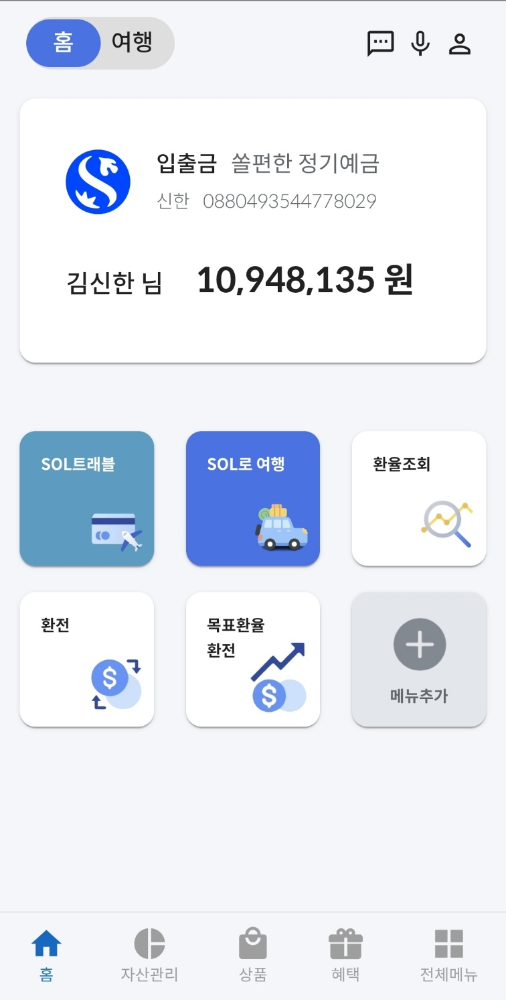

- 이 프로젝트는 신한 SOL 어플에 이식하는 형태를 생각하고 만든 프로젝트입니다.
- 그러므로 신한 쏠(SOL) 어플에서 이미 회원가입과 로그인을 완료했다고 가정하고 시작합니다.
- 이식하는 형태를 생각했다면 회원가입과 로그인 기능을 보여드리는 것이 의미가 없다고 생각했고, 시연을 위해 현재는 사이트 접속시 자동으로 김신한씨로 로그인합니다.
- 신한은행의 디자인을 차용하려고 했고, 자신의 이름과 계좌번호, 잔고를 보여줍니다.
- 이제 SOL로 여행을 클릭해줍니다.

### 2. 브릿지 페이지(BridgeView)

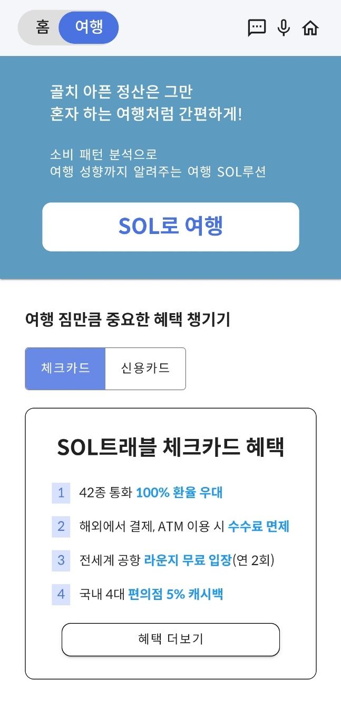

- 이 페이지는 SOL로 여행이라는 서비스를 소개하는 페이지입니다.
- SOL로 여행의 간략한 설명을 위에 두고, 아래에는 신한 은행의 제품 중 이 서비스와 연계할 수 있는 제품인 SOL트래플 체크카드, 신용카드 소개가 있습니다.
- 혜택 더보기를 클릭하면 새 창에서 신한은행의 SOL트래블 페이지가 열리게 됩니다.
- 이제 SOL로 여행을 클릭해줍니다.

### 3. 전체 여행 페이지(TripView)

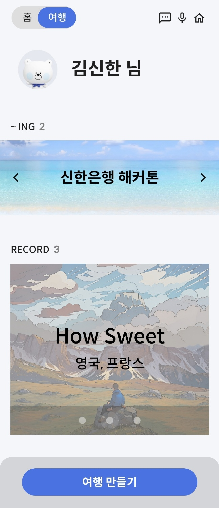

- 이 페이지는 사용자의 전체 여행을 보여주는 페이지입니다.
- 상단의 ~ING는 현재 진행중인 여행, 그리고 미래에 갈 여행을 보여줍니다.
- 하단의 RECORD는 완료된 여행들을 보여줍니다.
- 특히, 하단의 여행 썸네일은 사용자가 업로드한 사진을 생성형 AI를 활용하여 스케치 형식의 이미지로 변환한 것입니다.
- 이 내용은 추후 `완료된 여행 페이지`에서 다시 설명드리겠습니다.
- 이제 하단의 여행 만들기 버튼을 클릭하겠습니다.

### 4. 여행 생성 페이지(TripCreateView)

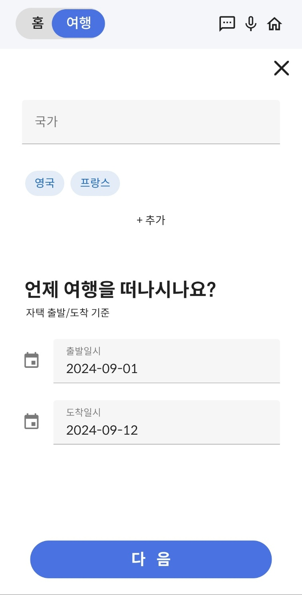
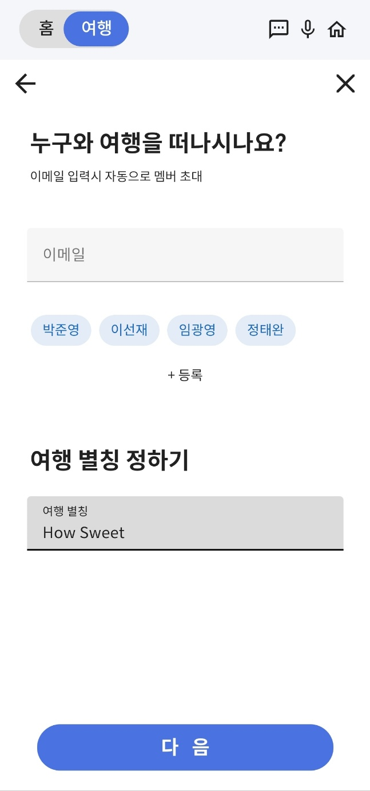

- 이 페이지는 여행을 생성하는 페이지입니다.
- 여행에 필요한 데이터로는
  <details>
    <summary>국가</summary>

  - 여러개의 국가를 추가할 수 있도록 설정
  - 생성된 국가 칩 클릭시 삭제
  </details>
  <details>
    <summary>출발/도착 일시</summary>

  - 출발 일시보다 도착 일시가 앞서면 경고 메시지 표기
  - 출발 일시보다 도착 일시가 앞서면 생성 불가 알람
  </details>
  <details>
    <summary>일행</summary>

  - 이메일 입력 시 일행 이름으로 된 칩 생성
  - 생성된 일행 칩 클릭시 삭제
  - 여러명의 일행을 추가할 수 있도록 설정
  - 자신을 일행으로 추가하려고 하면 에러 알람
  </details>
  <details>
    <summary>여행 이름</summary>
  </details>

- 이 있습니다.
- 모든 내용이 조건을 충족한다면 다음 버튼 클릭 시 여행이 생성됩니다.
- 전체 여행 페이지로 돌아가게 되고, 생성된 여행을 확인할 수 있습니다.
- 이제 ~ING중 하나의 여행을 클릭해줍니다. 저희는 신한은행 해커톤 여행을 추천드립니다.

### 5. 여행 메인 페이지(TripMainView)

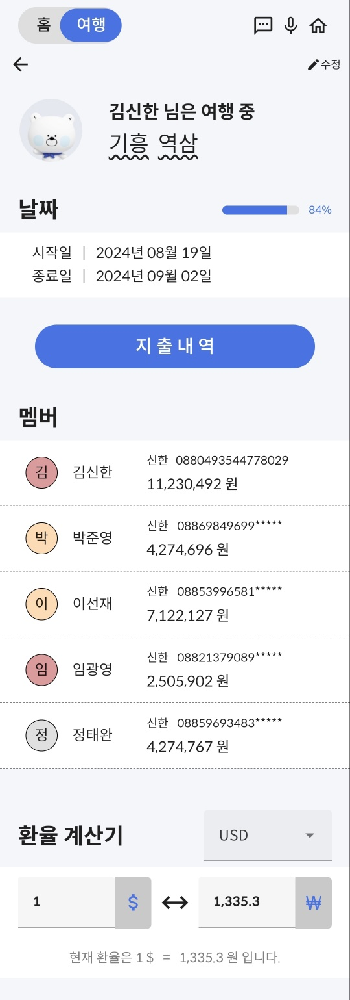

- 여행에 대한 정보를 제공하는 페이지입니다.
- 여행지, 여행 기간, 멤버, 환율에 대한 정보를 제공합니다.
- 최하단에는 여행자 보험 `함께 가입하기`버튼이 있습니다. 우선 이 버튼을 클릭해줍시다.
- 여행자 보험 가입 단계가 끝나면, 다시 이 페이지로 돌아오게 됩니다.
- 이제 지출내역 버튼을 클릭해줍니다.

#### 5-1. 보험 페이지(InsuranceView)

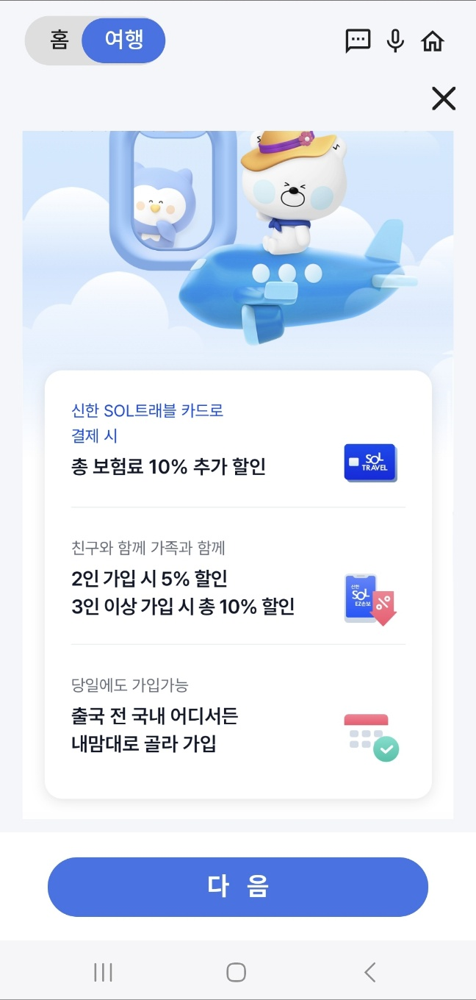
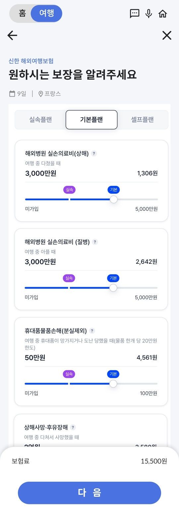
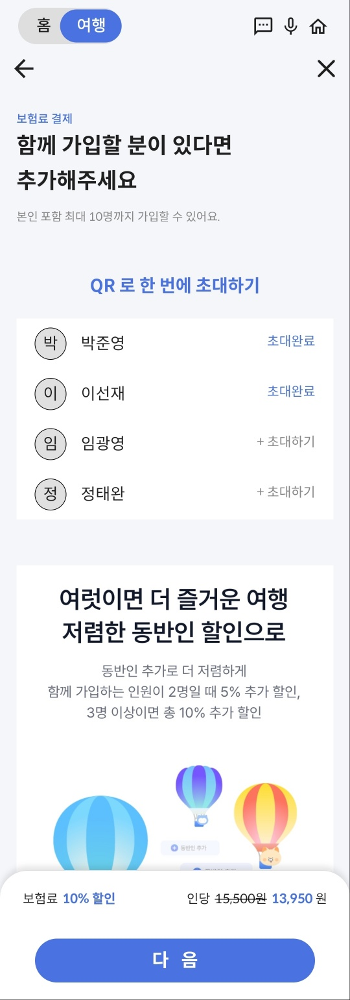

- 신한 SOL 트래블 보험을 안내하는 페이지입니다.
- 기본 정보 및 보장에 대한 정보도 제공합니다.
- 현재 여행의 멤버들을 초대하여 다같이 보험에 가입할 수 있으며, SOL 트래블 보험에서 제공하는 할인 혜택 또한 적용했습니다.
- 모든 과정이 완료되면 여행 메인 페이지로 이동합니다.

### 6. 여행 상세 페이지(TripDetailView)

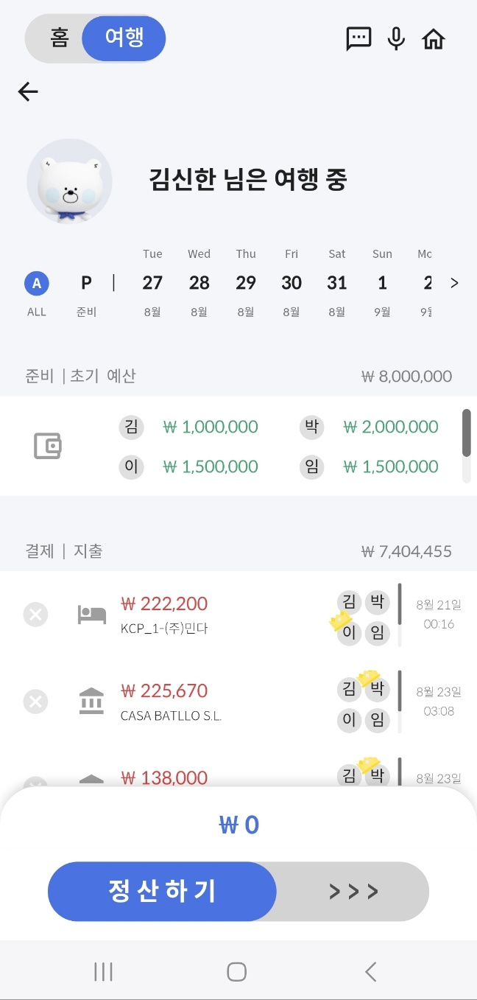

- 여행의 꽃, 결제 내역을 표기해주는 페이지입니다.
- 상단의 날짜를 클릭하면 해당 날짜의 결제 내역을 보여주고, 좌측의 A를 클릭하면 모든 결제 내역을 표기해줍니다.
- P를 클릭하면 여행 전 결제 내역이 표기되고, 결제 내역을 추가할 수 있습니다.
  - 항공, 숙박과 같은 경우 여행 전에 미리 결제하는 경우가 많아 결제 내역 추가 기능을 제공합니다.
- 예산은 초기, 잔여, 소비 예산을 보여줍니다. 예산 부분을 클릭하면 보여지는 정보가 달라지는 것을 볼 수 있습니다.
- 하단 결제에서는 자신이 결제한 결제 내역에 대해서만 정산할 수 있도록 설정했고, 정산이 완료되면 회색으로 표기됩니다.

### 7. 정산 완료 페이지(TripFinishView)

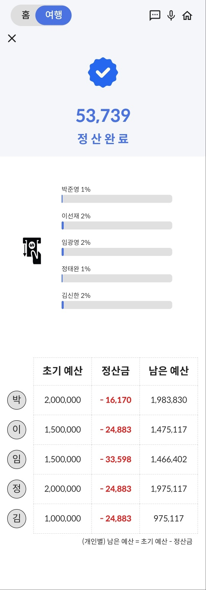

### 8. 전체 여행 페이지(TripView)

### 9. 완료된 여행 페이지(GalleryView)
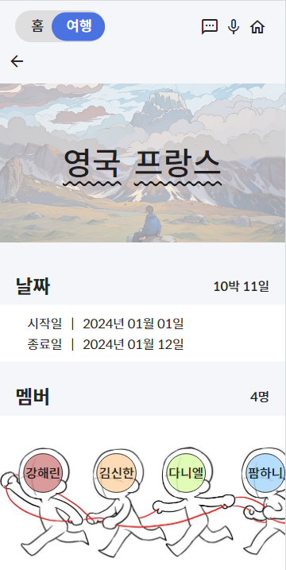
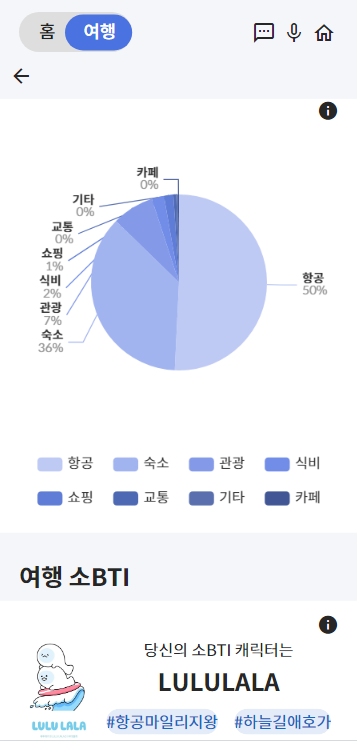
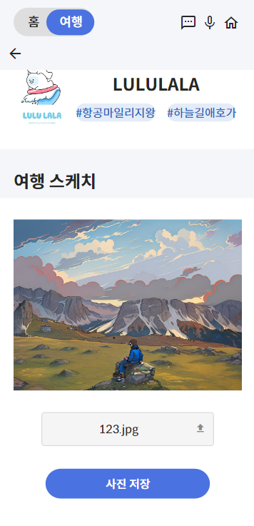
- 이미 다녀온 여행의 기록을 볼 수 있는 페이지입니다.
- 여행의 날짜와 멤버, 소비 내역을 볼 수 있습니다.
- 여행 소비 내역을 자동으로 카테고리화하여 분류하며, 이에 따라 소비 성향을 분석하여 사용자의 소BTI를 알려줍니다.
- 여행 스케치 기능을 통해 사용자의 여행 사진를 입력하면, 생성형 AI가 사진을 스케치해줍니다.
- 스케치 한 사진은 TripView에서 확인할 수 있습니다.


1. 설명 쭉 해주고
2. 이미지 생성 해보고
3. 맨 위 바뀌는거 확인하고?
4. 다시 TripView로 돌아가서 사진이 동기화되었는지 확인
